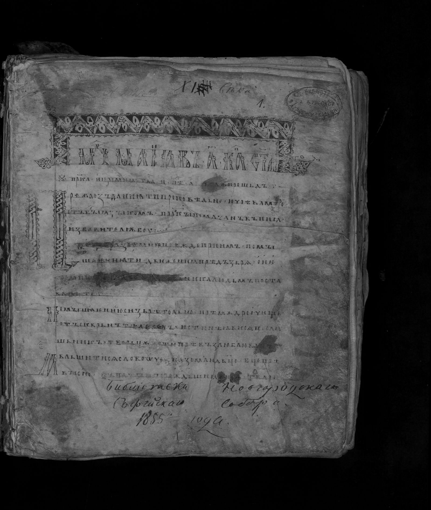
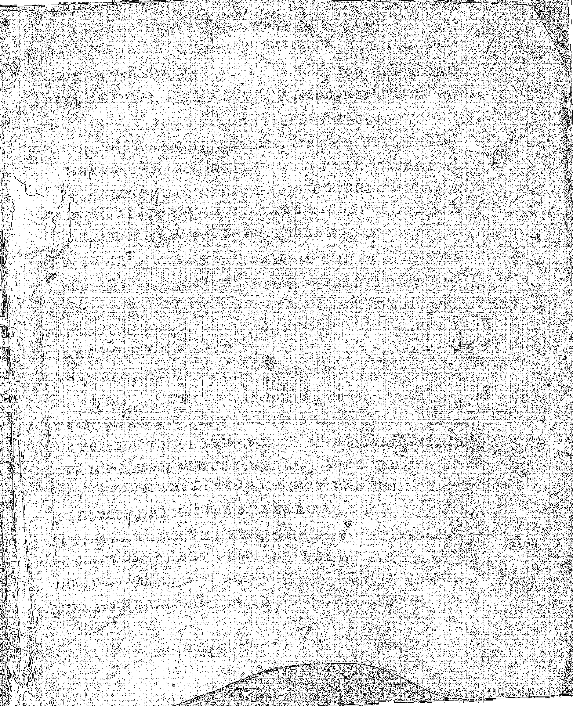
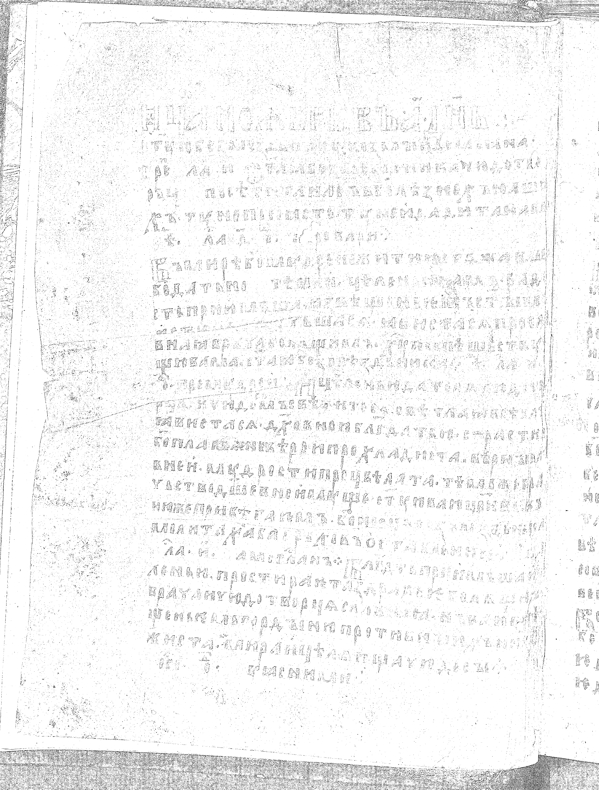
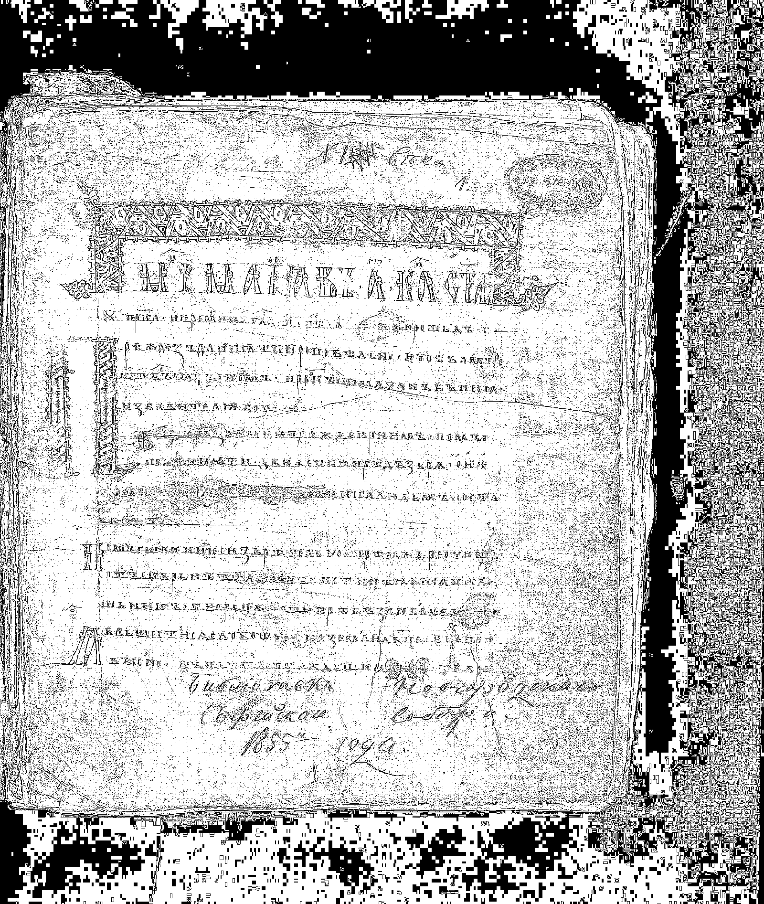
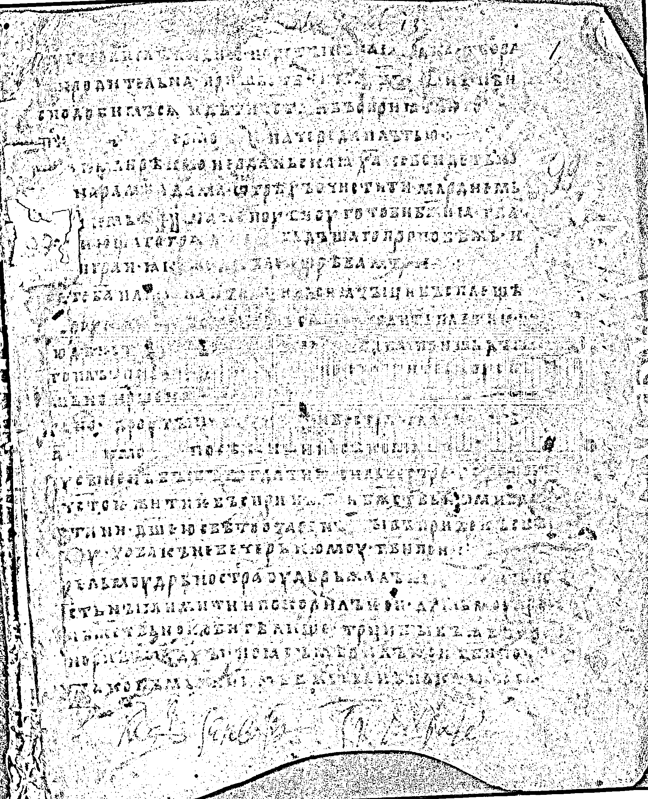
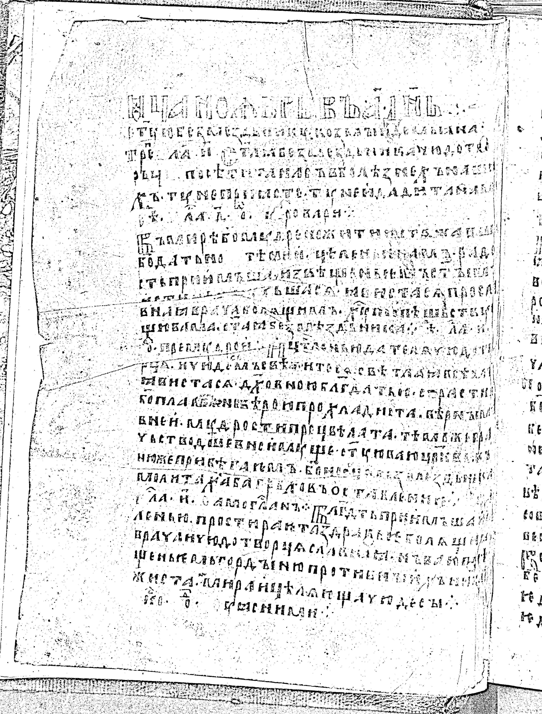
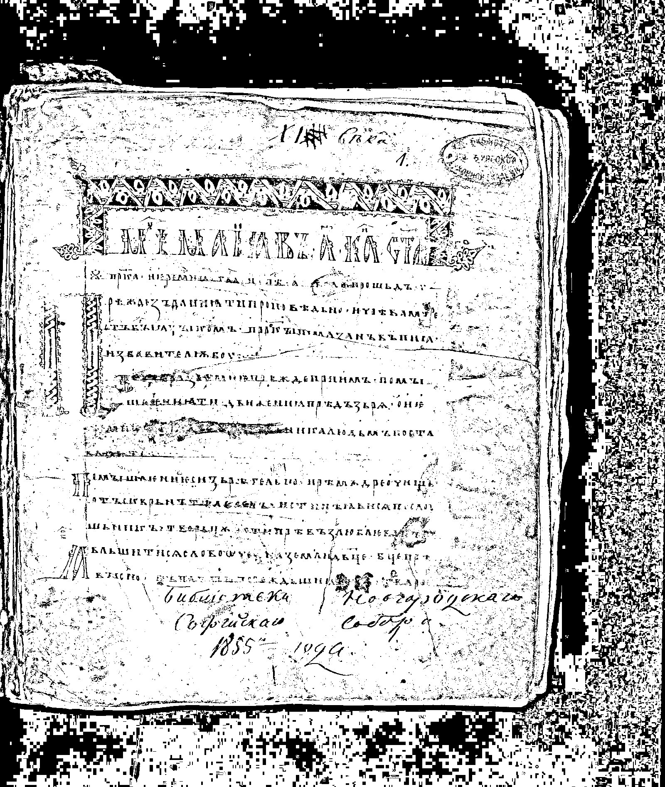

# Лабораторная работа №2 (Вариант №9)
## Обесцвечивание и бинаризация растровых изображений

### Описание

В данной работе реализованы две операции над растровыми изображениями **без использования библиотечных функций перевода в полутон и бинаризации**:

1. **Приведение полноцветного изображения к полутоновому**  
   Полутоновое изображение создаётся вручную по формуле взвешенного усреднения каналов:

   `Y = 0.299R + 0.587G + 0.114B`

2. **Приведение полутонового изображения к монохромному**  
   Используется **адаптивная бинаризация Сингха** с окном **3×3**.

---

# Исходные изображения

В качестве исходных изображений используются полноцветные изображения, получаемые через API сайта `https://www.slavcorpora.ru`.

Количество скачиваемых изображений (LIMIT) указано в main()

```bash
image_urls = fetch_sample_image_urls(ORIGIN, SAMPLE_ID, LIMIT)
```
Сам же LIMIT можно поменять в НАСТРОЙКАХ (LIMIT = NONE - нет лимита)

```bash
LIMIT = 3
```

| Исходное изображение 1 | Исходное изображение 2 | Исходное изображение 3 |
|---|---|---|
|  |  |  |

---

# Приведение изображения к полутону

Полутоновое изображение строится вручную по формуле взвешенного усреднения каналов:

```text
Y = 0.299R + 0.587G + 0.114B
```

| Полутоновое изображение 1 | Полутоновое изображение 2 | Полутоновое изображение 3 |
|---|---|---|
|  |  |  |


---
# Бинаризация полутонового изображения

Для бинаризации используется адаптивная бинаризация Сингха с окном 3×3.

```bash
SINGH_K = 0.05
WINDOW_SIZE = 3
```

Для бинаризации используется адаптивная бинаризация Сингха с окном 25×25.

```bash
SINGH_K = 0.15
WINDOW_SIZE = 25
```
Параметр метода Сингха (SINGH_K), влияющий на вычисление локального порога, подбирается экспериментально. В данной работе используется значение 0.05 для 3x3 и 0.15 для 25×25.


| Бинаризация изображения 1_3×3 | Бинаризация изображения 2_3×3 | Бинаризация изображения 3_3×3 |
|---|---|---|
|  |  |  |

| Бинаризация изображения 1_25×25 | Бинаризация изображения 2_25×25 | Бинаризация изображения 3_25×25 |
|---|---|---|
|  |  |  |

---

# Установка

Установка зависимостей:

```bash
pip install requests numpy pillow matplotlib
```

---
# Запуск программы

Запуск программы:

```bash
python DesaturationAndBinarizationRasterImages.py
```